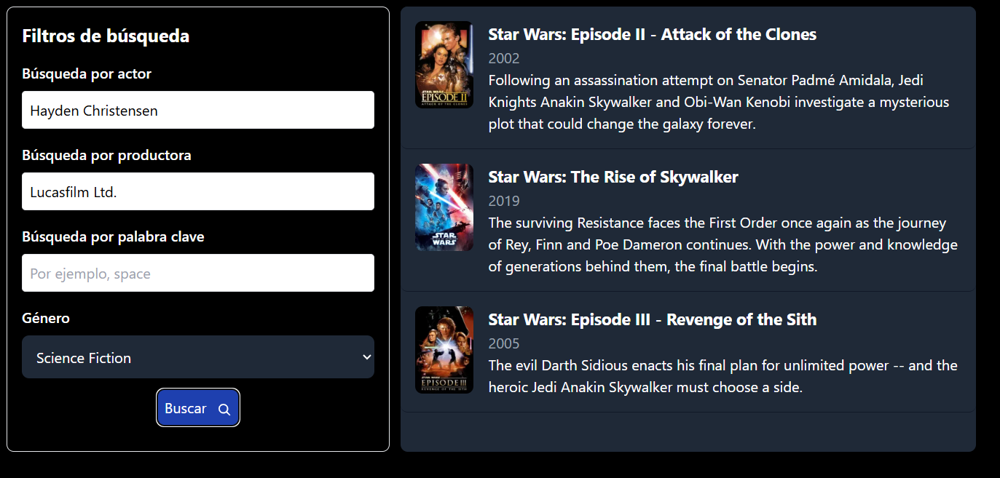

This is a [Next.js](https://nextjs.org/) project bootstrapped with [`create-next-app`](https://github.com/vercel/next.js/tree/canary/packages/create-next-app).

## Getting Started

First, run the development server:

```bash
npm run dev
# or
yarn dev
# or
pnpm dev
# or
bun dev
```

Open [http://localhost:3000](http://localhost:3000) with your browser to see the result.

## About project

This project is based on the TMDB API. Here you can search for movies by name or other criteria.

The stack of project is:

* Next.js
* React
* Redux
* TypeScript
* Tailwind

## Simple Seach

* **Search by name:** Use the navbar input search to find movies by name.

## Advance Search

Advanced search is a layout where you can search for movies using different criteria. These include:

* **Search by Genres:** Search for movies by genre. For example, you can search for movies in the "Comedy" genre.
* **Search by Cast:** Search for movies by actor name. For example, you can search for movies in which "Will Smith" acted.
* **Search by Company:** Search for movies by film producer. For example, you can search for movies produced by "Warner Bros."
* **Search by Keywords:** Search for movies by keyword. If you don’t remember the name of a movie about "space wars," you can write "space" and you will see the movies related to "space."

  This is a example of mixing search:
  
